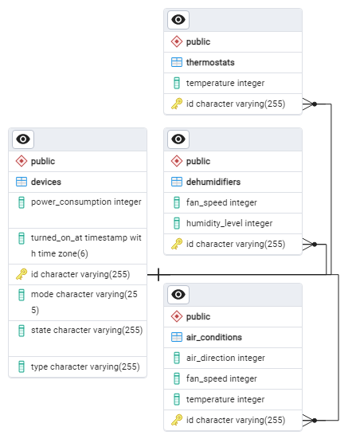
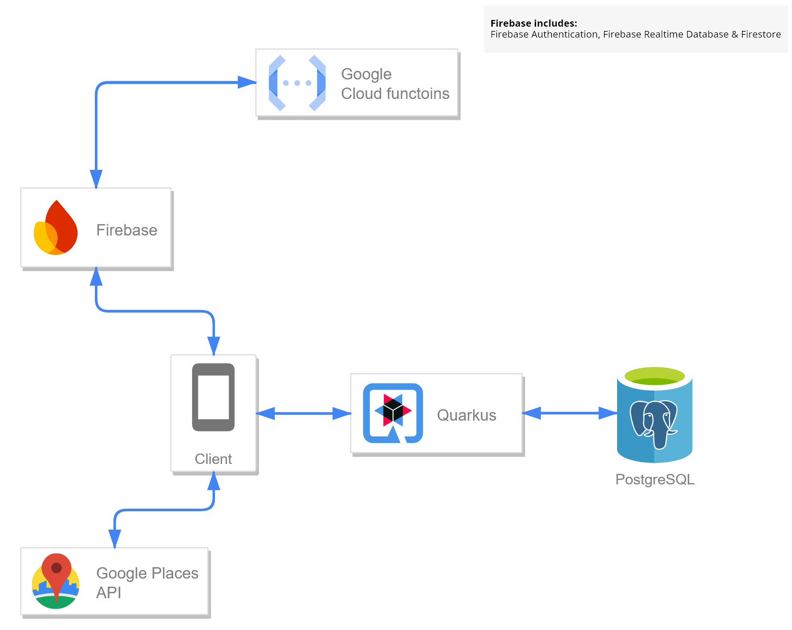

# Smart Living Smart Hub

## Project Overview

The Smart_Living_Hub repository contains a Java-based hub simulation that mimics the behavior of various smart devices in a home environment. Built using the Quarkus framework, the hub simulates API interactions with these devices, allowing the mobile app to control, monitor and update the status of each device. The hub acts as an intermediary between the smart devices and the Android application, ensuring seamless communication and real-time updates in response to user actions.

## Key Features

- **Smart Device Simulation:** The hub provides simulated APIs for a wide range of smart devices, allowing users to control devices such as thermostats, air conditions and dehumidifiers from the mobile app without needing physical devices for testing.
- **API Access:** The mobile app communicates with the simulated hub through API requests. This enables device management (e.g. turning on/off, adjusting settings) and the retrieval of device statuses for monitoring purposes.
- **Real-time Device Status Updates:** The hub updates each device's status based on user requests and interactions via the mobile app. For example, if a user changes the thermostat setting or turn off a dehumidifier, the hub reflects these changes and updates the device's state accordingly in the simulated environment.
- **Quarkus Framework:** The hub leverages Quarkus for fast startup times, low memory usage, and reactive architecture, ensuring it is well-suited for cloud-native microservices. This allows the hub to handle multiple API requests efficiently while simulating real-time device control.
- **PostgreSQL Integration:** A PostgreSQL database is used to store device state data, logs and any interactions with the hub. This provides a persistent record of device operations, which can be queried by the Android app for monitoring and energy tracking purposes.

## Dependencies

The Smart_Living_Hub project relies on several essential libraries and frameworks, each serving a specific role in building the application. Below is a summary of the main dependencies used in this project:

### Core Dependencies
- **Quarkus Framework**
    - **quarkus-rest:** Provides RESTful APIs, enabling the application to expose endpoints for device interactions.
    - **quarkus-rest-jackson:** Adds support for JSON serialization and deserialization using Jackson.
    - **quarkus-hibernate-orm-panache:** Simplifies database interactions and ORM mapping using Panache with Hibernate.
    - **quarkus-hibernate-validator:** Intregrates validation features (e.g. input validation) within the application.
    - **quarkus-arc:** Provides dependency injection support essential for building loosely coupled services in Quarkus.
- **PostgreSQL**
    - **quarkus-jdbc-postgresql:** A JDBC driver that allows the application to interact with PostgreSQL databases.
- **Lombok**
    - **lombok:** A utility library that reduces boilerplacte code (e.g. getters, setters, constructors) by using annotations. It helps improve code readability and maintainability.

### Dependency Management
- **quarkus-bom:** The Quarkus BOM (Bill of Materials) manages the versions of all Quarkus-related dependencies to ensure compatibility.

## PostgreSQL Schema



## Setup Instructions

1. Clone the Repository:

    ```bash
    git clone https://github.com/ApostolisSiampanis/Smart_Living_Hub.git
    cd Smart_Living_Hub
    ```

2. Install Java and Maven:

    - Ensure **Java 17** and **Maven** are installed on your machine.
    - Verify installations:

      ```bash
      java -version
      mvn -version
      ```

3. Set Up PostgreSQL

    - Install and Configure PostgreSQL
    - Create a new database
  
      ```sql
      CREATE DATABASE smart_living_hub
      ```

4. Update Database Configuration:

    Edit the `application.properties` file in `src/main/resources/` with your PostgreSQL connection details (username, password, and database URL).

5. Build and Run the Application:

    - Build the Quarkus application:

       ```bash
       ./mvnw clean package
       ```

    - Run the Quarkus development mode:
  
       ```bash
       ./mvnw quarkus:dev
       ```

6. Access the Application:

    The application will be available at `http://localhost:8080`.

## Application Diagram



## Related Repositories

This project is part of a larger system, consisting of multiple repositories that work together to provide a complete smart energy management solution:
1. **[Smart Living Android Kotlin App:](https://github.com/ApostolisSiampanis/Smart_Living)** This repository contains the source code for an Android application designed to manage and monitor smart devices within a user's environment. Developed in Kotlin, the application adheres to Clean Architecture principles, ensuring a clear separation of conserns, maintainability and testability. It leverages Jetpack Compose to create a modern, responsive user interface that enhances user experience through efficient device control and real-time energy monitoring.
2.  **[Smart Living Server:](https://github.com/ApostolisSiampanis/Smart_Living_Server)** This repository contains the server-side logic for managing backend operations in the Smart Living system. It integrates with Firebase services, including Firestore, Realtime Database, Firebase Authentication and implements various HTTP and scheduled functions to facilitate user data management, device power consumption monitoring and historical data handling. The server functions are designed to support real-time interactions and periodic maintenance of smart device data, enhancing system reliability and user experience.

## License

This project is licensed under the MIT License - see the [LICENSE](./LICENSE) file for details.
